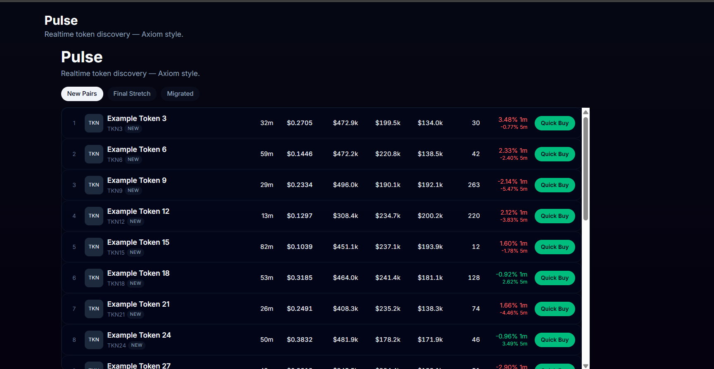
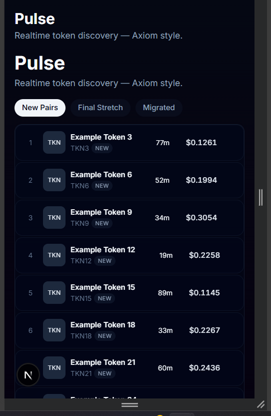

 Token Discovery Dashboard — Axiom 

A responsive, real-time token discovery dashboard inspired by Axiom’s token explorer UI.  
Built with modern React + Next.js features and optimized virtualization for smooth scrolling performance.

*Live Deployment (Vercel):*
https://token-discovery-table-axiom-website-issi258rq.vercel.app/pulse


 Features

- Real-time token updates with mock API backend
- Virtualized list for high-performance rendering of 60+ tokens
- Filtering by token lifecycle categories:
  - New Pairs
  - Final Stretch
  - Migrated
- Responsive UI optimized for all screen sizes 
- Clean dark theme inspired by Axiom UX
- Smooth hover + interactive Quick Buy modal


## Desktop Preview

> Responsive layout — large screens



---

## Mobile Preview (320px width)

> Complete mobile layout support




## Tech Stack

 Tools Used 

Frontend Framework -> Next.js 16 (App Router) 
Query Caching -> React Query (TanStack Query) 
Virtual Scrolling -> TanStack React-Virtual 
UI Components -> TailwindCSS + Shadcn UI 
Mock Backend -> Next.js API Route 
Deployment -> Vercel 


# Local Setup

```bash
# Install dependencies
npm install

# Start local development server
npm run dev

# Build for production
npm run build

# Run production preview
npm start
